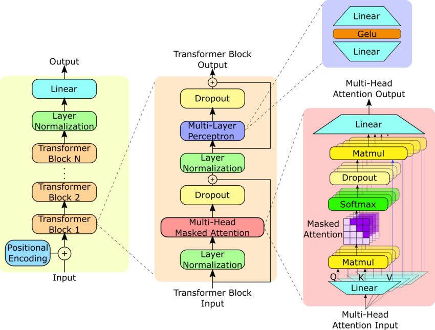
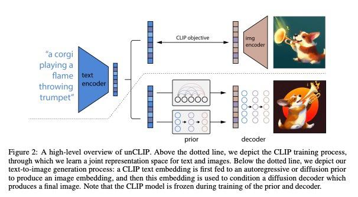

# OpenAI API 주요 엔드포인트
## 주요 모델에 대한 설명
### GPT

* 대규모 데이터셋을 이용해 사전학습한 생성형 모델
* Transformer의 decoder만 사용하여 구조화 되어있음
* 자연어 처리, 번역, 요약 등 다양한 분야에 활용됨
### Dall-E

* 살바도르 달리와 월E에서 따옴
* CLIP - Diffusion Prior - Decoder 과정을 통해 이미지를 생성
* CLIP: 텍스트 임베딩과 이미지 임베딩을 정렬, 주어진 텍스트가 얼마나 이미지와 관련이 있는지를 알려줌
* Diffusion Prior: 텍스트 임베딩과 연관된 CLIP 이미지 임베딩을 찾는 것 (예측)
* Diffusion Prior에서 예측된 CLIP 이미지 임베딩을 사용하여 이미지를 생성
## Chat Completions
* URL: /v1/chat/completions
* Chat GPT를 사용하는 것 처럼 프롬프트에서 텍스트를 생성하기 위한 API
* 코드, 수학 방정식, 구조화된 JSON 데이터, 사람이 쓴 것과 같은 산문 등을 생성 가능
```javascript
return await fetch('https://api.openai.com/v1/chat/completions', {
      method: 'POST',
      headers: {
        'Content-Type': 'application/json',
        'Authorization': 'Bearer '
      },
      body: JSON.stringify({
        'model': 'gpt-4o-mini',
        'messages': [
          {
            'role': 'developer',
            'content': 'You are a helpful assistant.',
          },
          {
            'role': 'user',
            'content': 'let me know what is a gpt'
          }
        ]
      })
    })
```
## Fine-tuning
* URL: /v1/fine-tuning
* 사전 훈련 모델을 추가로 훈련시킴, 프롬프트에 여러 예제를 제공할 필요가 없으므로, 비용 절감과 대기 시간이 짧아짐
* 과정: 훈련 데이터 업로드 -> 모델 학습 -> 결과 평가 -> 평가에 따라 1단계로 다시 -> 파인 튜닝 모델 사용
```javascript
import OpenAI from "openai";

const openai = new OpenAI();

const fineTune = await openai.fineTuning.jobs.create({
  training_file: 'file-abc123',
  model: 'gpt-4o-mini-2024-07-18'
});
```
## Image
### Generations
* URL: /v1/images/generations
* 프롬프트로 이미지를 생성함
```javascript
return await fetch('https://api.openai.com/v1/images/generations', {
      method: 'POST',
      headers: {
        'Content-Type': 'application/json',
        'Authorization': 'Bearer '
      },
      body: JSON.stringify({
        'model': 'dall-e-2',
        'prompt': "cat is playing nexon game",
        "n": 1,
        "size": "256x256"
      })
    })
```

### Edit
* URL: /v1/images/edit
* 마스크를 사용하여 특정 영역을 대체하거나 편집, 확장할 수 있음
```javascript
    const selectedFile = document.getElementById("input").files[0]
    const selectedFile2 = document.getElementById("input2").files[0]
    const formData = new FormData()
    formData.append('model', 'dall-e-2')
    formData.append('image', selectedFile)
    formData.append('mask', selectedFile2)
    formData.append('prompt', 'the dog is playing game')
    formData.append('n', 1)
    formData.append('size', '256x256')

    return await fetch('https://api.openai.com/v1/images/edits', {
      method: 'POST',
      headers: {
        'Authorization': 'Bearer '
      },
      body: formData
    })
```

### Variations
* URL: /v1/images/variations
* 입력 이미지를 변형 시킴
```javascript
    const selectedFile = document.getElementById("input").files[0]
    const formData = new FormData()
    formData.append('model', 'dall-e-2')
    formData.append('image', selectedFile)
    formData.append('n', 1)
    formData.append('size', '256x256')

    return await fetch('https://api.openai.com/v1/images/variations', {
      method: 'POST',
      headers: {
        'Authorization': 'Bearer '
      },
      body: formData
    })
```

## Audio
### Text To Speech (TTS)
* URL: /v1/audio/speech
* 입력한 텍스트를 음성으로 변환함
* 음성 옵션은 alloy, ash, coral, echo, fable, onyx, nova, sage, shimmer를 지원
* 참고 : https://platform.openai.com/docs/guides/text-to-speech
```javascript
return await fetch('https://api.openai.com/v1/audio/speech', {
      method: 'POST',
      headers: {
        'Content-Type': 'application/json',
        'Authorization': 'Bearer '
      },
      body: JSON.stringify({
        "model": "tts-1",
        "input": "Hello world, i'm taewoo lee. welcome",
        "voice": "alloy"
      })
    })
```
<audio controls src="tts.mp3" title="Title"></audio>

### Speech To Text (STT) - Transcription
* URL: /v1/audio/transcriptions
* 입력한 음성을 텍스트로 변환(필사)
```javascript
    const selectedFile = document.getElementById("input").files[0]
    const formData = new FormData()
    formData.append('model', 'whisper-1')
    formData.append('file', selectedFile)
    formData.append('response_format', 'text')

    return await fetch('https://api.openai.com/v1/audio/transcriptions', {
      method: 'POST',
      headers: {
        'Authorization': 'Bearer '
      },
      body: formData
    })
```
### Speech To Text (STT) - Translation
* URL: /v1/aduio/translations
* 입력한 음성을 영어로 변환함
* 지원되는 입력 언어는 다음과 같음 `Afrikaans, Arabic, Armenian, Azerbaijani, Belarusian, Bosnian, Bulgarian, Catalan, Chinese, Croatian, Czech, Danish, Dutch, English, Estonian, Finnish, French, Galician, German, Greek, Hebrew, Hindi, Hungarian, Icelandic, Indonesian, Italian, Japanese, Kannada, Kazakh, Korean, Latvian, Lithuanian, Macedonian, Malay, Marathi, Maori, Nepali, Norwegian, Persian, Polish, Portuguese, Romanian, Russian, Serbian, Slovak, Slovenian, Spanish, Swahili, Swedish, Tagalog, Tamil, Thai, Turkish, Ukrainian, Urdu, Vietnamese, and Welsh.`
## Embeddings
* URL: /v1/embeddings
* 입력한 텍스트 문자열의 토큰 간 유사도, 관련성을 측정함
* 검색 (결과가 쿼리 문자열과의 관련성에 따라 순위가 매겨짐)
* 클러스터링 (텍스트 문자열이 유사성에 따라 그룹화되는 경우)
* 추천 (관련 텍스트 문자열이 있는 항목이 추천되는 경우)
* 이상치 감지 (관련성이 거의 없는 이상치가 식별되는 경우)
* 다양성 측정 (유사성 분포가 분석되는 곳)
* 분류 (텍스트 문자열이 가장 유사한 레이블로 분류되는 경우)
```javascript
return await fetch('https://api.openai.com/v1/embeddings', {
      method: 'POST',
      headers: {
        'Content-Type': 'application/json',
        'Authorization': 'Bearer '
      },
      body: JSON.stringify({
        "input": "test sentence hello world",
        "model": "text-embedding-3-small"
      })
    })
```
```json
{
  "object": "list",
  "data": [
    {
      "object": "embedding",
      "index": 0,
      "embedding": [
        -0.006827223,
        -0.05881094,
        0.04470913,
        -0.0038359314,
        -0.026667902,
        -0.011724796,
        -0.027402371,
        0.008813628,
        0.009701668,
        0.0014530802,
        0.028711062,
        -0.0030647388,
        -0.0075583537,
        0.021580035,
        -0.0069908095,
        0.004029564,
      ]
    }
  ],
  "model": "text-embedding-3-small",
  "usage": {
    "prompt_tokens": 4,
    "total_tokens": 4
  }
}
```
## Function calling
* OpenAI 모델이 외부 서비스와 인터페이스할 수 있도록 도와주는 기능
* 최신 정보를 가져와서 모델의 응답(RAG)에 통합
* 응답에 따라 API를 호출하여 워크플로우 작업을 진행함
```javascript
return await fetch('https://api.openai.com/v1/chat/completions', {
      method: 'POST',
      headers: {
        'Content-Type': 'application/json',
        'Authorization': 'Bearer '
      },
      body: JSON.stringify({
        'model': 'gpt-4o-mini',
        "messages": [
            {
                "role": "user",
                "content": "Can you send an email to test@test.com  saying hi?"
            }
        ],
        "tools": [
            {
                "type": "function",
                "function": {
                    "name": "send_email",
                    "description": "Send an email to a given recipient with a subject and message.",
                    "parameters": {
                        "type": "object",
                        "properties": {
                            "to": {
                                "type": "string",
                                "description": "The recipient email address."
                            },
                            "subject": {
                                "type": "string",
                                "description": "Email subject line."
                            },
                            "body": {
                                "type": "string",
                                "description": "Body of the email message."
                            }
                        },
                        "required": [
                            "to",
                            "subject",
                            "body"
                        ],
                        "additionalProperties": false
                    },
                    "strict": true
                }
            }
        ]
      })
    })
```
```json
{
  "id": "chatcmpl-B0ODy5IxNrwjlKH0vTs9SSHfuz5Jh",
  "object": "chat.completion",
  "created": 1739432818,
  "model": "gpt-4o-mini-2024-07-18",
  "choices": [
    {
      "index": 0,
      "message": {
        "role": "assistant",
        "content": null,
        "tool_calls": [
          {
            "id": "call_Xa79xYe3y2Um3GTSRFqszdFi",
            "type": "function",
            "function": {
              "name": "send_email",
              "arguments": "{\"to\":\"test@test.com\",\"subject\":\"Hello\",\"body\":\"Hi!\"}"
            }
          }
        ],
        "refusal": null
      },
      "logprobs": null,
      "finish_reason": "tool_calls"
    }
  ],
  "usage": {
    "prompt_tokens": 92,
    "completion_tokens": 30,
    "total_tokens": 122,
    "prompt_tokens_details": {
      "cached_tokens": 0,
      "audio_tokens": 0
    },
    "completion_tokens_details": {
      "reasoning_tokens": 0,
      "audio_tokens": 0,
      "accepted_prediction_tokens": 0,
      "rejected_prediction_tokens": 0
    }
  },
  "service_tier": "default",
  "system_fingerprint": "fp_bd83329f63"
}

```